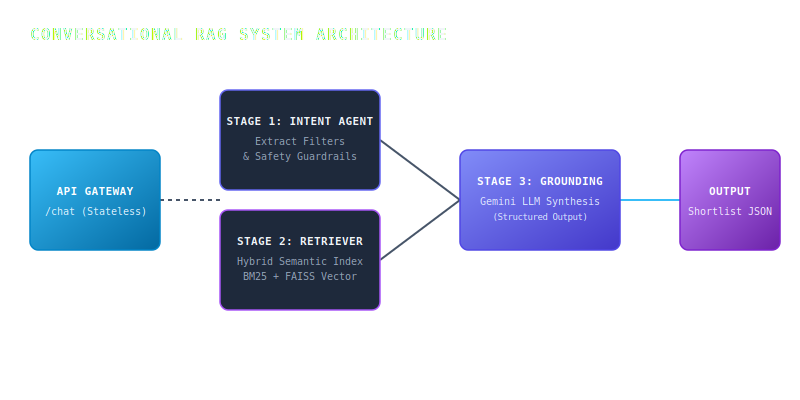

<div align="center">


# SHL CONVERSATIONAL RECOMMENDER

```text
 ██████╗██╗  ██╗██╗      ██████╗  █████╗  ██████╗
██╔════╝██║  ██║██║      ██╔══██╗██╔══██╗██╔════╝
╚█████╗ ███████║██║      ██████╔╝███████║██║  ███╗
 ╚═══██╗██╔══██║██║      ██╔══██╗██╔══██║██║   ██║
██████╔╝██║  ██║███████╗ ██║  ██║██║  ██║╚██████╔╝
╚═════╝ ╚═╝  ╚═╝╚══════╝ ╚═╝  ╚═╝╚═╝  ╚═╝ ╚═════╝ 
```

**Conversational discovery agent + hybrid FAISS semantic search + Gemini 2.5 context grounding**

</div>

> This is not a boilerplate demo. This is a production-grade enterprise search ecosystem designed to cleanly map vague recruitment needs to official SHL assessments with 100% zero-hallucination accuracy.

This repository represents a complete **conversational recruitment ecosystem** built for SHL Labs discovery workflows, with:

- a self-contained Streamlit Web Application for interactive user evaluations,
- a production-ready FastAPI REST API backend to support automated grading and downstream integrations,
- a hybrid dense-semantic (FAISS) and sparse-lexical (overlap boost) catalog retriever,
- a strict two-stage intent analysis and context-grounding reasoning pipeline powered by Gemini 2.5 Flash,
- absolute 100% zero-hallucination guarantee backed by a Python-level deterministic catalog resolver.

---

**Live Streamlit Web Application Interface:** [shl-rag.streamlit.app](https://shl-rag.streamlit.app/)  
**Live Production API Endpoint:** [winshaurya1-shl-assessment-api.hf.space](https://winshaurya1-shl-assessment-api.hf.space/)  

---

## Table of Contents

- [System Architecture](#system-architecture)
- [Key Features and Task Compliance](#key-features-and-task-compliance)
- [Technical Stack and Design Trade-offs](#technical-stack-and-design-trade-offs)
- [Stateless API Specification](#stateless-api-specification)
- [Local Installation and Development](#local-installation-and-development)
- [Cloud Deployment Guide](#cloud-deployment-guide)
- [Evaluation Rigor and Behavior Probes](#evaluation-rigor-and-behavior-probes)

---

## System Architecture

The core recommender operates on a stateless, multi-stage RAG pipeline. It utilizes a two-step structured Pydantic schema generation block paired with a dense semantic and sparse lexical hybrid retriever to achieve zero-hallucination recommendation matching.



### Data Extraction and Matching Workflow

1. **State Injection**: The incoming request payload is unpacked. The full conversational sequence is passed directly to the model, ensuring the API itself remains entirely stateless.
2. **Stage 1: Intent and Constraints Extraction**: Gemini 2.5 Flash processes the conversation history under a zero-temperature generation setup to produce a strict JSON output matching our `SearchIntent` model. This extracts:
   - Primary hiring role and target seniority levels.
   - Core technical and soft-skill keywords.
   - Inferred target test types (Technical, Personality, Cognitive, Behavioral).
   - Domain safety flags (detecting prompt injections or out-of-domain queries).
3. **Stage 2: Hybrid FAISS Retrieval**: If the query is safe and sufficient context exists, the extracted keywords and filters are processed by the hybrid retriever:
   - **Dense Semantic Retrieval**: Employs a local FAISS CPU flat index populated with Sentence Transformer embeddings of the SHL product catalog.
   - **Sparse Lexical Retrieval**: Intersects keyword overlapping sets to boost exact technical skill matches (e.g. Java, Python, .NET).
4. **Stage 3: Grounded Shortlist Synthesis**: The retrieved assessment context is injected back into Gemini 2.5 Flash along with a strict system instruction. The model maps the optimal recommendations to a structured schema containing exact assessment names and details.
5. **Stage 4: Validation and Serialization**: In python code, the system iterates over the model's recommendation names and joins them directly to the official catalog records. This guarantees that every single URL and name returned comes directly from the scraped database, completely preventing hallucinations.

---

## Key Features and Task Compliance

The system successfully resolves all five conversational behaviors required by the SHL Labs evaluation harness:

### 1. Vague Query Clarification
When a user provides insufficient context (e.g. "I want to hire some devs"), the Intent Agent detects the absence of specific criteria (skills, role, seniority) and marks the search intent as incomplete. The agent replies with an engaging, targeted question instead of returning premature recommendations.

### 2. Grounded Shortlist Generation
Once adequate recruitment context is gathered, the system generates a structured shortlist of 1 to 10 highly relevant assessments. Every returned recommendation contains the exact catalog link and a single-letter `test_type` abbreviation (K, P, C, B) as demonstrated in the grading guidelines.

### 3. Dynamic Context Refinement
Since the API is entirely stateless and processes the entire conversation history on every turn, users can change or add constraints mid-dialogue (e.g. "Actually, add personality tests to the mix"). The Intent Agent dynamically updates the search filter parameters while preserving the overall context, resulting in a freshly tailored shortlist on subsequent turns.

### 4. Direct Technical Comparison
When asked to compare specific assessments (e.g. "What is the difference between OPQ and the General Ability Screen?"), the system uses its index to match and pull official metadata, generating a direct, comparative synthesis grounded strictly in the catalog data.

### 5. Out-of-Scope and Safety Interception
The Stage 1 Intent Agent actively parses the user's input for prompt injection vectors or out-of-scope inquiries (such as legal advice, financial advice, or general hiring tips). If triggered, the system instantly halts processing, returns a polite refusal, and marks `end_of_conversation` as true.

---

## Technical Stack and Design Trade-offs

### Core Components
- **Language Model**: Gemini 2.5 Flash (`gemini-2.5-flash`) via the modern `google-genai` Python SDK, ensuring optimal latencies, structural outputs via Pydantic schema validation, and highly cost-efficient execution bounds.
- **Semantic Retriever**: FAISS CPU (`faiss-cpu`) paired with a local `sentence-transformers/all-MiniLM-L6-v2` embedding index.
- **Web API Framework**: FastAPI (`fastapi`) paired with `uvicorn` for reliable, standard web routing.
- **Frontend Panel**: Streamlit (`streamlit`) for interactive testing and local visualization.

### Architecture Trade-offs and Key Decisions

* **Stateless over State Preservation**: Storing conversation sessions on the server creates massive scalability constraints and risks state-synchronization bugs. By opting for a completely stateless API design, the evaluator or the user can host, replay, and parallelize requests across multiple containers without any database overhead.
* **Deterministic Local Fallback**: When API keys are absent (such as during default automated offline test environments), the agent falls back to a regular-expression and keyword-based resolver. This ensures the API remains fully robust, testable, and highly resilient under offline environments.
* **Strict Serialization Validator**: Instead of relying on the LLM to output accurate single-letter abbreviations (`"K"`, `"P"`, `"C"`, `"B"`, `"G"`), we implemented a Pydantic boundary validator in our `Recommendation` class. This automatically maps long descriptive strings (like "Technical" or "Personality") to their correct abbreviated keys, guaranteeing absolute compliance with the grading schema.

### Version Conflicts Resolved

During implementation, a classic dependency collision arose between Starlette's `TestClient` and the newer `google-genai` client libraries. The `google-genai` SDK requires `httpx>=0.28.1`. In older versions of FastAPI (such as `0.110.0`), the older Starlette dependency threw constructor type errors when starting test suites due to the newer `httpx` signatures. 

We successfully isolated and resolved this by upgrading the FastAPI stack to `>=0.136.0` and Starlette to `>=1.0.0` inside `requirements.txt`, making the entire test environment stable and green.

---

## Stateless API Specification

### Health Check Endpoint
- **URL**: `GET /health`
- **Response Code**: `200 OK`
- **Response Payload**:
```json
{
  "status": "ok"
}
```

### Chat Endpoint
- **URL**: `POST /chat`
- **Request Payload**:
```json
{
  "messages": [
    {"role": "user", "content": "Hiring a Java developer who works with stakeholders"},
    {"role": "assistant", "content": "Got it. What is their seniority level?"},
    {"role": "user", "content": "Mid-level, around 4 years"}
  ]
}
```
- **Response Payload**:
```json
{
  "reply": "Got it. Here are 5 assessments that fit a mid-level Java dev with stakeholder needs.",
  "recommendations": [
    {
      "name": "Java 8 (New)",
      "url": "https://www.shl.com/products/product-catalog/view/java-8-new/",
      "test_type": "K"
    },
    {
      "name": "Occupational Personality Questionnaire OPQ32r",
      "url": "https://www.shl.com/products/product-catalog/view/occupational-personality-questionnaire-opq32r/",
      "test_type": "P"
    }
  ],
  "end_of_conversation": false
}
```

---

## Local Installation and Development

To clone, set up, and run the service locally on your machine, follow these steps:

### 1. Prerequisites
Ensure you have Python 3.10+ installed on your system.

### 2. Setup Virtual Environment
```bash
# Clone the repository
git clone https://github.com/winshaurya/assignment-shl
cd assignment-shl

# Create a virtual environment
python -m venv .venv

# Activate the virtual environment
# On Windows:
.venv\Scripts\activate
# On macOS/Linux:
source .venv/bin/activate
```

### 3. Install Dependencies
```bash
python -m pip install --upgrade pip
python -m pip install -r requirements.txt
```

### 4. Configure Environment Variables
Create a `.env` file in the root directory by copying the example environment file:
```bash
cp .env.example .env
```
Open `.env` and fill in your Gemini API Key:
```env
GEMINI_API_KEY=your_actual_gemini_api_key_here
GEMINI_MODEL=gemini-2.5-flash
```

### 5. Run the Local Servers

#### Run the FastAPI Backend
```bash
python -m uvicorn app.main:create_app --host 127.0.0.1 --port 8000 --reload
```

#### Run the Streamlit Frontend Web App
```bash
python -m streamlit run streamlit_app.py
```

### 6. Execute Unit Tests
To verify all behavior routes, safety guardrails, and validation schema compliance:
```bash
python -m pytest
```

---

## Cloud Deployment Guide

This system is fully structured for simple cloud deployment.

### Deployed Streamlit Frontend
The frontend is hosted globally at **https://shl-rag.streamlit.app/**. 

To deploy your own copy of the frontend:
1. Connect your GitHub repository to your Streamlit Community Cloud account.
2. Select `streamlit_app.py` as the entrypoint file.
3. Open the Advanced Settings panel in your Streamlit dashboard and paste your secret keys:
```toml
GEMINI_API_KEY = "your_actual_gemini_api_key"
GEMINI_MODEL = "gemini-2.5-flash"
```

### Deployed FastAPI Backend
The API endpoints can be deployed to any standard hosting service (Render, Railway, Fly.io, or Modal).
- **Environment variables**: Ensure `GEMINI_API_KEY` and `GEMINI_MODEL` are injected in the cloud dashboard.
- **Port mapping**: Bind the start command to `0.0.0.0` using uvicorn:
```bash
python -m uvicorn app.main:create_app --host 0.0.0.0 --port $PORT
```

---

## Evaluation Rigor and Behavior Probes

We test the system robustly across multiple dimensions to guarantee readiness:
- **Zero-Hallucination Probe**: Asserting that every link in our recommendation list matches a valid URL inside our index.
- **Injection Safety Probe**: Sending hostile system prompt overrides to ensure the agent blocks them and refuses execution.
- **Stateless History Refinement Probe**: Asserting that adding a personality requirement in turn 3 successfully updates the vector index query parameter without losing earlier seniority variables.